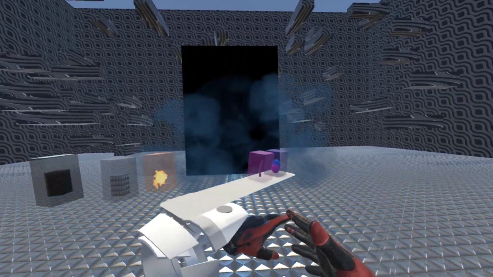

## The project 🚀
Loopaworld is a student project made by a group of friends while I was working on [WasteFair](https://github.com/KokelSan/WasteFair). After the semester, they wanted to continue the development and asked me to join the team !
The goal of the project was to create an original experience by linking the environment with the music. More than just hear the music, we wanted to see its influence on the world and allow the player to control this.

In that way, the player can place figurines in the world and each of them are linked to a specific track and a specific physical element in the scene. When the figurine is placed, the track starts playing as well as the action on the world. Here it is : we can see the music 🎵. When all the tracks are playing, they assemble a full song, and the intensity of the scene is at its peak.

As well as grabing and placing a figurine, the player can put it upside down to mute its track, change its volume by adjusting its height in the scene and hit it* to stop it and put it back in the catalog. It is contained in a magical wristband activated by touching it while looking at it (my previous work on HoloLens 2 inspired me for this one, I confess).

*No figurines were harmed in this, promise !

## What I learned 🌟
- It was the first time I joined a project that wasn't mine and that I didn't started !
- I dived in the world of audio and spectre analysis to be able to synchronize actions/animations with the music
- Encouraged by our teacher, we submitted the project to a famous VR competition : The Laval Virtual Awards. It was a newer way to approach the project, more stressful and more personal

## Gallery 🖼️
|||
:-------------------------:|:-------------------------:
|It's time to Mu-mu-mu-Music !|When all figurines are placed, this is a real experience|

## Video 🎥
Here is the presentation video we made for our participation at the Laval Virtual Awards 2023

